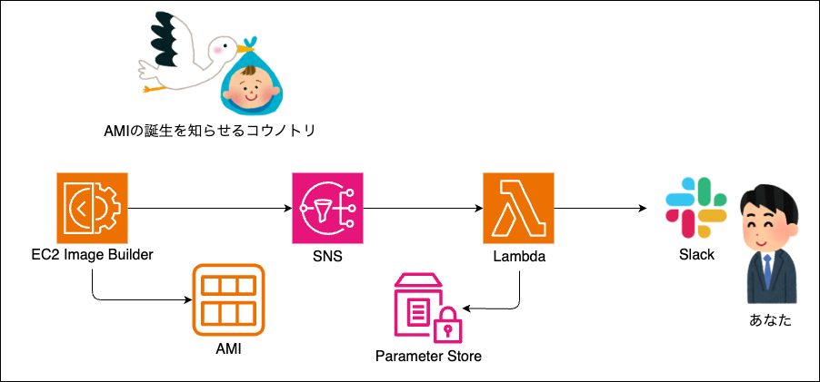
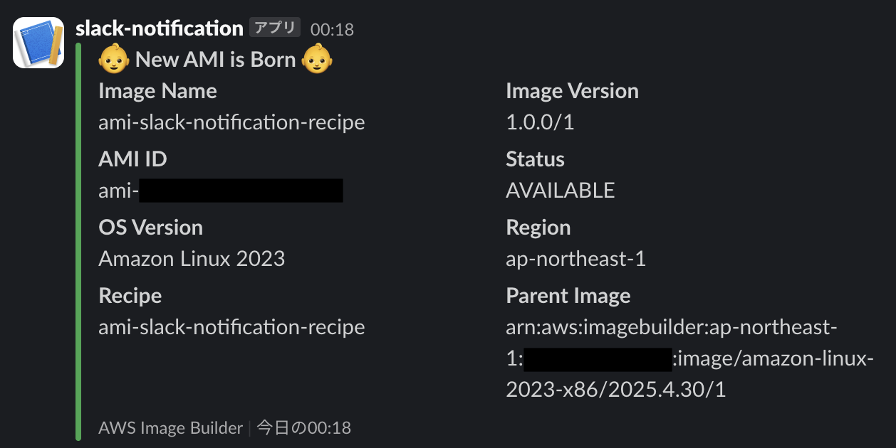

# ami-birth-notify

EC2 Image Builder で作成されたAMIをSlackに通知するサンプルアプリです、  
新たなAMIの産声を聞きましょう。

## アーキテクチャ


## 通知イメージ


## 事前準備

* Slack Webhook URL 取得
* Terraform実行環境/実行権限

## 作成

`terraform.tfvars` を作成して、terraform applyします。

```
cat <<EOF >> ./terraform/terraform.tfvars
slack_webhook_url = "https://hooks.slack.com/services/XXX/XXX/XXX" # 取得したSlack Webhook URL
slack_channel     = "#channel-name"                                # 通知先Slack Channel
app_name          = "ami-slack-notification"                       # アプリ名
aws_region        = "ap-northeast-1"                               # 作成リージョン
EOF
```
```
cd ./terraform;
terraform init;
terraform apply;
```

作成が完了したら、terraform outputで出力されるコマンドでイメージパイプラインを実行します。  
AMIの作成が完了すると、Slackに通知が来ます。

```
terraform output;
```
```
aws imagebuilder start-image-pipeline-execution --image-pipeline-arn ${aws_imagebuilder_image_pipeline.example.arn}
```

## 削除

以下でリソースを削除します。  
なお作成されたイメージは削除されないため、必要に応じて削除を実施してください。

```
terraform destroy;
```
